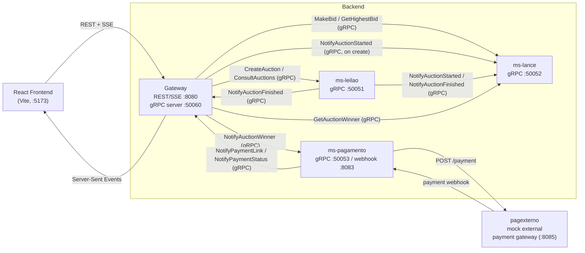

# Auction System

A distributed auction platform built in Go, using a microservices architecture where independent services communicate over **gRPC** and the frontend receives live updates over **Server-Sent Events (SSE)**. Auctions are scheduled and run automatically, bids are validated and broadcast in real time, and the winner is routed through a simulated payment flow (payment link generation + webhook confirmation).

A React + TypeScript frontend (Vite) is included for creating auctions, placing bids, and watching live auction activity.

## Project evolution

This repository's default branch has moved from `master` to **`grpc`**, which marks a full rewrite of how the backend services talk to each other:

- **Before (`master`):** services were decoupled through a **RabbitMQ** topic exchange (`leilao_events`) — `ms-leilao` and `ms-lance` published events, and the Gateway consumed them asynchronously to feed its SSE stream. The Gateway also called `ms-leilao`/`ms-lance` over plain REST.
- **Now (`grpc`, current default):** RabbitMQ has been replaced end-to-end by **gRPC**. Every service (`ms-leilao`, `ms-lance`, `ms-pagamento`, and the Gateway itself) exposes a gRPC server and holds gRPC clients to the peers it needs to talk to; `.proto` contracts under `proto/` now define every cross-service interaction. The old RabbitMQ client code (`pkg/rabbitmq`, `internal/gateway/rabbitmq`) is still present in the tree but is no longer imported anywhere — it's dead code left over from the previous architecture.
- As part of the same rewrite, the frontend/Gateway port mismatch that existed on `master` (the frontend called `:8080` while the Gateway's example config pointed elsewhere) has been fixed — both now agree on `:8080` by default.

The sections below describe the system **as it stands on `grpc`**.

## Architecture



Every cross-service call is now a direct gRPC request instead of an event published to a broker. The Gateway plays two roles at once: it's a **gRPC client** to `ms-leilao`/`ms-lance`/`ms-pagamento` (for requests coming from the frontend), and it's a **gRPC server** (`GatewayService`) that those same services call back into whenever something happens (an auction finishing, a payment link being issued, a payment being confirmed) — the Gateway then turns that notification into an SSE event for the browser.

## Services

| Service | Path | gRPC port | Other ports | Responsibility |
|---|---|---|---|---|
| **Gateway** | `cmd/gateway` | `50060` (server, receives notifications) | `8080` REST/SSE (`PORT` env) | Public REST API + SSE endpoint for the frontend; gRPC client to the three services below; gRPC server that receives their notifications and re-broadcasts them as SSE |
| **ms-leilao** | `cmd/msleilao` | `50051` | — | Owns auction lifecycle: creation, validation, in-memory storage, and automatic start/end scheduling; notifies `ms-lance` and the Gateway via gRPC when an auction starts/finishes |
| **ms-lance** | `cmd/mslance` | `50052` | — | Tracks each active auction's highest bid and winner, validates incoming bids |
| **ms-pagamento** | `cmd/mspagamento` | `50053` | `8083` webhook (hardcoded) | Requests a payment link from `pagexterno` once notified of a winner, receives the payment webhook, and notifies the Gateway of the link and final status |
| **pagexterno** | `internal/pagexterno` | — | `8085` | Standalone mock of a third-party payment processor (serves a simple HTML pay page and fires a webhook back to `ms-pagamento`); unaffected by the gRPC migration |
| **Frontend** | `frontend/` | — | `5173` (Vite dev) | React/TypeScript UI for creating auctions, bidding, and watching live updates |

## Communication model

Two distinct gRPC patterns are used, mirroring what used to be REST calls and RabbitMQ events respectively:

- **Request/response RPCs** — used wherever the Gateway needs an answer to hand back to the frontend synchronously: `LeilaoService.CreateAuction`, `LeilaoService.ConsultAuctions`, `LanceService.MakeBid`, `LanceService.GetHighestBid`, `LanceService.GetAuctionWinner`. The Gateway itself builds the SSE event straight from the RPC response (e.g. a successful `MakeBid` call immediately produces a `lance_validado` SSE event) — there's no intermediate broker step anymore.
- **One-way notification RPCs** — used where a service needs to fan an event out to another without waiting on it: `LanceService.NotifyAuctionStarted/Finished`, `PagamentoService.NotifyAuctionWinner`, and `GatewayService.NotifyAuctionFinished/NotifyPaymentLink/NotifyPaymentStatus`. These play the same role the RabbitMQ routing keys used to play, just as direct calls instead of pub/sub.

### gRPC services (`proto/`)

| Service | RPCs |
|---|---|
| `LeilaoService` | `CreateAuction`, `ConsultAuctions` |
| `LanceService` | `MakeBid`, `GetHighestBid`, `NotifyAuctionStarted`, `NotifyAuctionFinished`, `GetAuctionWinner` |
| `PagamentoService` | `NotifyAuctionWinner` |
| `GatewayService` | `NotifyAuctionFinished`, `NotifyPaymentLink`, `NotifyPaymentStatus` |

## API reference (Gateway, REST/SSE — unchanged for the frontend)

The frontend and any external client should only talk to the **Gateway**; its public surface is the same as before the migration, just backed by gRPC internally now.

| Method | Path | Description |
|---|---|---|
| `GET` | `/consult-auctions` | List all auctions (→ `LeilaoService.ConsultAuctions`) |
| `POST` | `/create-auction` | Create an auction — body: `{ "description": string, "start": RFC3339, "end": RFC3339 }` |
| `POST` | `/make-bid` | Place a bid — body: `{ "user_id": string, "leilao_id": string, "valor": number }` |
| `GET` | `/highest-bid?auctionId=` | Get the current highest bid for an auction |
| `GET` | `/register-interest/:auctionID/stream?clienteID=` | Open an SSE stream for real-time updates on that auction |
| `GET` | `/cancel-interest` | *(not implemented yet — returns `501`)* |

## Getting started

### Prerequisites

- Go 1.24+
- Node.js 18+ (for the frontend)
- `protoc` + the Go plugins (`protoc-gen-go`, `protoc-gen-go-grpc`) — only needed if you plan to edit a `.proto` file and regenerate code with `gen-proto.sh`; the generated `*.pb.go` files are already committed under `proto/`, so a plain `go build` works without them.

RabbitMQ is **no longer required** on this branch.

### Backend

```bash
git clone -b grpc https://github.com/gUI-pe/auction-system.git
cd auction-system
go mod download
```

Every backend service needs to be reachable before the Gateway can finish starting, because the Gateway dials `ms-leilao`, `ms-lance`, **and** `ms-pagamento` over gRPC at boot (with a blocking connection). Start them in this order:

```bash
go run cmd/msleilao/main.go      # gRPC :50051
go run cmd/mslance/main.go       # gRPC :50052
go run internal/pagexterno/pagexterno.go   # mock payment processor, :8085
go run cmd/mspagamento/main.go   # gRPC :50053, webhook :8083
go run cmd/gateway/main.go       # REST/SSE :8080, gRPC :50060
```

> **Note:** `exec.sh` in the repo root only runs `ms-leilao`, `ms-lance`, and the Gateway — it predates `ms-pagamento` being a hard dependency of the Gateway's startup and will currently leave the Gateway unable to start on its own. Run the five commands above manually until `exec.sh` is updated, or start `ms-pagamento` (and `pagexterno`) first and adjust the script.

### Frontend

```bash
cd frontend
npm install
npm run dev
```

The dev server runs on `http://localhost:5173` and talks to the Gateway on `http://localhost:8080` by default (see `frontend/src/lib/api.ts`). CORS on the Gateway is hardcoded to allow this origin.

## Configuration

Only the Gateway loads a `.env` file (`cmd/gateway/.env`); the other services fall back to hardcoded defaults unless you export the variables yourself.

| Service | Variable | Default | Purpose |
|---|---|---|---|
| Gateway | `PORT` | `8080` | REST/SSE port for the frontend |
| Gateway | `MSLEILAO_GRPC` | `localhost:50051` | Address of `ms-leilao`'s gRPC server |
| Gateway | `MSLANCE_GRPC` | `localhost:50052` | Address of `ms-lance`'s gRPC server |
| Gateway | `MSPAGAMENTO_GRPC` | `localhost:50053` | Address of `ms-pagamento`'s gRPC server |
| Gateway | `GATEWAY_GRPC_PORT` | `50060` | Port the Gateway's own gRPC server listens on |
| ms-leilao | `GRPC_PORT` | `50051` | Port ms-leilao's gRPC server listens on |
| ms-leilao | `MSLANCE_GRPC` | `localhost:50052` | Where to send auction start/finish notifications |
| ms-leilao | `GATEWAY_GRPC` | `localhost:50060` | Where to send auction-finished notifications |
| ms-lance | `GRPC_PORT` | `50052` | Port ms-lance's gRPC server listens on |
| ms-pagamento | `GRPC_PORT` | `50053` | Port ms-pagamento's gRPC server listens on |
| ms-pagamento | `PUBLIC_URL` | `http://localhost:8083` | Base URL `pagexterno` uses to call back with payment status |
| ms-pagamento | `PAGEXTERNO_URL` | `http://localhost:8085` | Where to request payment links |
| ms-pagamento | `GATEWAY_GRPC` | `localhost:50060` | Where to send payment link/status notifications |

> **Note:** the checked-in `cmd/gateway/.env.example` still has the *pre-gRPC* keys (`RABBITMQ_HOST`, `MSLEILAO_HOST`, `MSLANCE_HOST`, `PORT=8082`) and doesn't reflect any of the variable names above — it hasn't been updated since the migration. Use the table above rather than that file until it's refreshed.

## Project layout

```
.
├── cmd/
│   ├── gateway/            # REST/SSE API + gRPC server for inbound notifications
│   ├── mslance/            # Bidding microservice (gRPC)
│   ├── msleilao/           # Auction lifecycle microservice (gRPC)
│   └── mspagamento/        # Payment orchestration microservice (gRPC + webhook)
├── internal/
│   ├── gateway/
│   │   ├── grpc/           # gRPC clients (to leilao/lance/pagamento) + GatewayService server
│   │   ├── sse/            # SSE event stream + client registry
│   │   └── rabbitmq/       # unused leftover from the pre-gRPC architecture
│   ├── mslance/            # Bidding domain logic + gRPC server
│   ├── msleilao/           # Auction domain logic, scheduling, + gRPC server
│   ├── mspagamento/        # Payment domain logic, webhook server, + gRPC server
│   └── pagexterno/         # Standalone mock external payment gateway (HTTP, unchanged)
├── proto/
│   ├── gateway/            # GatewayService contract + generated code
│   ├── leilao/             # LeilaoService contract + generated code
│   ├── lance/              # LanceService contract + generated code
│   └── pagamento/          # PagamentoService contract + generated code
├── pkg/
│   ├── models/             # Shared message/event structs
│   └── rabbitmq/           # unused leftover from the pre-gRPC architecture
├── frontend/               # React + TypeScript + Vite client
├── gen-proto.sh            # Regenerates *.pb.go from the .proto files
├── exec.sh                 # Convenience script (currently out of date, see above)
├── go.mod / go.sum
└── README.md
```

## Tech stack

- **Backend:** Go, [gRPC](https://grpc.io/) / Protocol Buffers, [Gin](https://github.com/gin-gonic/gin) (REST/SSE), Server-Sent Events
- **Frontend:** React 19, TypeScript, Vite, Tailwind CSS, `react-hot-toast`

## Known gaps

- **`exec.sh` doesn't start `ms-pagamento`**, but the Gateway now blocks at startup until it can dial `ms-leilao`, `ms-lance`, **and** `ms-pagamento` — so running `exec.sh` alone will fail to bring the Gateway up. Start `ms-pagamento` (and `pagexterno`) first, per the [Getting started](#getting-started) section.
- **Possible duplicate "auction started" notification:** the Gateway's `CreateAuction` handler calls `LanceService.NotifyAuctionStarted` right after creating the auction, while `ms-leilao`'s own scheduler independently calls the same RPC once the auction's actual start time arrives — `ms-lance` may receive this notification twice for the same auction.
- `cmd/gateway/.env.example` is stale (pre-gRPC keys); see the [Configuration](#configuration) note above.
- `GET /cancel-interest` is still a stub and returns `501 Not Implemented`.
- CORS on the Gateway is hardcoded to `http://localhost:5173`.
- `pkg/rabbitmq` and `internal/gateway/rabbitmq` are dead code kept from the previous architecture; they compile but are no longer referenced by any `main.go`.

## Authors

- Guilherme Peruci Felippe — [guilhermefelippe@alunos.utfpr.edu.br](mailto:guilhermefelippe@alunos.utfpr.edu.br)
- Caique Ferraz Cornelio — [caiqueferraz@alunos.utfpr.edu.br](mailto:caiqueferraz@alunos.utfpr.edu.br)

Instituto de Informática – Universidade Tecnológica Federal do Paraná (UTFPR)
